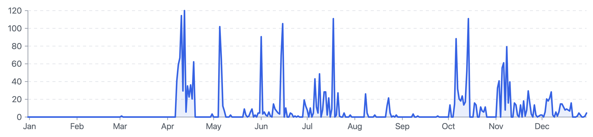

# git-heatmaps

HTTP server that generates SVG heatmaps and line charts from GitHub and GitLab contribution data.

**April - September = GitLab contributions** 

**October - Present = Github contributions**


## Features

- 📊 **Contribution Heatmaps**: Visualize daily contribution activity with customizable themes
- 📈 **History Charts**: Track contribution trends over time with line charts
- 🔄 **Multi-Provider Support**: Aggregate data from both GitHub and GitLab simultaneously
- 🏢 **Self-Hosted GitLab**: Support for self-hosted GitLab instances (e.g., university deployments)
- ⚡ **Caching**: Built-in memory cache for improved performance
- 🎨 **Customizable Themes**: Multiple color themes including source-aware default theme, GitHub, GitLab, and custom options

## Prerequisites

- **Docker** and **Docker Compose** ([Installation Guide](https://www.docker.com/get-started))
- **GitHub Personal Access Token** 
  - Generate at: https://github.com/settings/tokens
  - Required scope: `read:user`
- **GitLab Personal Access Token** 
  - For GitLab.com: Settings → Access Tokens
  - For self-hosted instances: Your GitLab instance → Settings → Access Tokens
  - Required scope: `read_api` or `api`

## Installation

### 1. Clone the Repository

```bash
git clone <repository-url>
cd git-heatmaps
```

### 2. Configure Environment Variables

Create a `.env` file in the project root:

```env
# GitHub Configuration (Required for GitHub support)
GITHUB_TOKEN=ghp_your_github_token_here

# GitLab Configuration
# For GitLab.com, use:
GITLAB_TOKEN=glpat_your_gitlab_token_here
GITLAB_BASE_URL=https://gitlab.com

# For self-hosted GitLab instances (e.g., university deployments):
# GITLAB_TOKEN=glpat_your_token_here
# GITLAB_BASE_URL=https://gitlab.your-university.edu
```

**Configuration Notes:**
- `GITHUB_TOKEN`: Required for GitHub functionality. GitHub's GraphQL API requires authentication.
- `GITLAB_TOKEN`: Optional but recommended. Unauthenticated requests have stricter rate limits.
- `GITLAB_BASE_URL`: 
  - Defaults to `https://gitlab.lrz.de` if not specified
  - For GitLab.com: `https://gitlab.com`
  - For self-hosted instances: Your instance's base URL (e.g., `https://gitlab.university.edu`)
- `PORT`: Server port (defaults to `3000`)

### 3. Start the Service

```bash
docker compose up --build
```

The service will be available at `http://localhost:3000`.

### 4. Verify Installation

Check the health endpoint:

```bash
curl http://localhost:3000/health
```

## API Reference

### Health Check

```http
GET /health
```

Returns the health status of the service.

### Heatmap

Generate a contribution heatmap as an SVG image for a specific year.

```http
GET /heatmap?githubUsername={username}&gitlabUsername={username}&year={year}&theme={theme}
```

**Query Parameters:**

| Parameter | Type | Required | Description |
|-----------|------|----------|-------------|
| `githubUsername` | string | Yes* | GitHub username |
| `gitlabUsername` | string | Yes* | GitLab username |
| `year` | number | No | Year to display (e.g., `2024`). Defaults to current year if not provided. Must be between 2000 and current year. |
| `theme` | string | No | Color theme: `default`, `github`, `gitlab`, `ice`, `fire`, `candy`, `rainbow`, `neon` (default: `default`) |

\* At least one of `githubUsername` or `gitlabUsername` is required.

**Response:** SVG image (`image/svg+xml`)


### History

Generate a contribution history line chart as an SVG image for a specific year.

```http
GET /history?githubUsername={username}&gitlabUsername={username}&year={year}
```

**Query Parameters:**

| Parameter | Type | Required | Description |
|-----------|------|----------|-------------|
| `githubUsername` | string | Yes* | GitHub username |
| `gitlabUsername` | string | Yes* | GitLab username |
| `year` | number | No | Year to display (e.g., `2024`). Defaults to current year if not provided. Must be between 2000 and current year. |

\* At least one of `githubUsername` or `gitlabUsername` is required.

**Response:** SVG image (`image/svg+xml`)



## Examples

### GitHub Heatmap

```bash
curl "http://localhost:3000/heatmap?githubUsername=octocat&year=2024&theme=github" > heatmap.svg
```

### GitLab Heatmap (Self-Hosted Instance)

```bash
curl "http://localhost:3000/heatmap?gitlabUsername=someUser&year=2024&theme=gitlab" > heatmap.svg
```

### Combined GitHub and GitLab Heatmap

```bash
curl "http://localhost:3000/heatmap?githubUsername=octocat&gitlabUsername=someUser&year=2024&theme=fire" > heatmap.svg
```

### Year-Specific Heatmap

```bash
curl "http://localhost:3000/heatmap?githubUsername=octocat&year=2024&theme=ice" > heatmap.svg
```

### History Chart

```bash
curl "http://localhost:3000/history?githubUsername=octocat&gitlabUsername=someUser&year=2024" > history.svg
```

### Available Themes

- `default` - Source-aware theme: green for GitHub-only, orange for GitLab-only, pink for mixed contributions
- `github` - GitHub's classic green theme
- `gitlab` - GitLab's orange theme
- `ice` - Cool blue gradient
- `fire` - Warm orange-red gradient
- `candy` - Purple-pink gradient
- `rainbow` - Multi-color gradient
- `neon` - Dark theme with neon accents

## Self-Hosted GitLab Configuration

This service supports self-hosted GitLab instances commonly used by universities and organizations.

### Example: University GitLab Instance

```env
GITLAB_TOKEN=glpat_your_university_token
GITLAB_BASE_URL=https://gitlab.university.edu
```

### Example: Corporate GitLab Instance

```env
GITLAB_TOKEN=glpat_your_corporate_token
GITLAB_BASE_URL=https://gitlab.company.com
```

**Important Notes:**
- Ensure your GitLab instance is accessible from the Docker container
- Use the full base URL (including protocol: `https://` or `http://`)
- The token must have `read_api` or `api` scope
- Self-hosted instances may have different rate limits than GitLab.com

## Stopping the Service

```bash
docker compose down
```

## Troubleshooting

### GitHub Service Disabled

If you see `GitHub service: disabled (no GITHUB_TOKEN)`, ensure your `.env` file contains a valid `GITHUB_TOKEN`.

### GitLab Authentication Issues

- Verify your token has the correct scopes (`read_api` or `api`)
- For self-hosted instances, ensure the `GITLAB_BASE_URL` is correct and accessible
- Check that the token hasn't expired

### Rate Limiting

- Authenticated requests have higher rate limits
- Consider adding tokens for both GitHub and GitLab to maximize rate limits
- The service includes caching to reduce API calls

