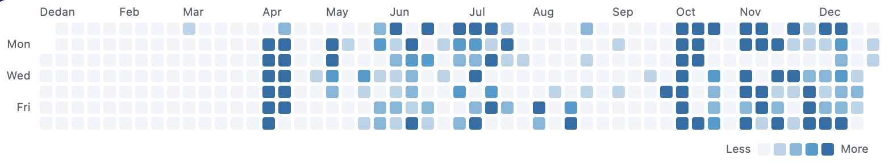

```
 ██████╗ ██╗████████╗    ██╗  ██╗███████╗ █████╗ ████████╗███╗   ███╗ █████╗ ██████╗ ███████╗
██╔════╝ ██║╚══██╔══╝    ██║  ██║██╔════╝██╔══██╗╚══██╔══╝████╗ ████║██╔══██╗██╔══██╗██╔════╝
██║  ███╗██║   ██║       ███████║█████╗  ███████║   ██║   ██╔████╔██║███████║██████╔╝███████╗
██║   ██║██║   ██║       ██╔══██║██╔══╝  ██╔══██║   ██║   ██║╚██╔╝██║██╔══██║██╔══██╗╚════██║
╚██████╔╝██║   ██║       ██║  ██║███████╗██║  ██║   ██║   ██║ ╚═╝ ██║██║  ██║██║  ██║███████║
 ╚═════╝ ╚═╝   ╚═╝       ╚═╝  ╚═╝╚══════╝╚═╝  ╚═╝   ╚═╝   ╚═╝     ╚═╝╚═╝  ╚═╝╚═╝  ╚═╝╚══════╝
```

### *Your contribution story, beautifully visualized*

---

Git Heatmaps is an HTTP service that generates beautiful SVG visualizations from your GitHub and GitLab contribution data. It aggregates contributions from multiple sources into unified heatmaps, line charts, and artistic patterns. Perfect for showcasing your coding journey on personal websites, READMEs, or portfolios.

---

## HOW TO USE

Embed your contribution visualizations in any markdown file by using standard image syntax with the appropriate endpoint URL. Simply add your access tokens and optional parameters as query strings. For example: ``. The service returns SVG images that render directly in GitHub READMEs, personal websites, documentation, and any platform that supports markdown or HTML images. Customize your visualization with different themes, time ranges, and data sources.



---

## FEATURES

### heatmap
Generate a contribution heatmap calendar showing your daily activity over a year. Supports customizable themes and automatically detects contribution sources (GitHub-only, GitLab-only, or mixed) when using the default theme.

### history
Create a line chart tracking your contribution trends over time. Visualizes total daily contributions aggregated from all configured sources as a smooth timeline.

### art
Generate artistic patterns using the heatmap visualization system. Create decorative contribution calendars with predefined patterns and themes for aesthetic purposes.

---

## QUERY PARAMETERS

### `/heatmap` Endpoint

| Parameter | Type | Required | Description |
|-----------|------|----------|-------------|
| `githubtoken` | string | Yes* | GitHub personal access token (username resolved automatically) |
| `gitlabtoken` | string | Yes* | GitLab personal access token (username resolved automatically) |
| `gitlabbaseurl` | string | No | GitLab instance base URL for self-hosted instances (e.g., `https://gitlab.example.com`). Defaults to GitLab.com if not specified. |
| `year` | number | No | Year to display (e.g., `2024`). Must be between 2000 and current year. Defaults to rolling year (last 365 days) if not provided. |
| `theme` | string | No | Color theme: `default`, `github`, `gitlab`, `ice`, `fire`, `candy`, `rainbow`, `neon`. Defaults to `default` (source-aware coloring). |

\* **At least one token required** (`githubtoken` or `gitlabtoken`)

---

### `/history` Endpoint

| Parameter | Type | Required | Description |
|-----------|------|----------|-------------|
| `githubtoken` | string | Yes* | GitHub personal access token (username resolved automatically) |
| `gitlabtoken` | string | Yes* | GitLab personal access token (username resolved automatically) |
| `gitlabbaseurl` | string | No | GitLab instance base URL for self-hosted instances |
| `year` | number | No | Year to display (e.g., `2024`). Must be between 2000 and current year. Defaults to rolling year if not provided. |

\* **At least one token required** (`githubtoken` or `gitlabtoken`)

---

### `/art` Endpoint

| Parameter | Type | Required | Description |
|-----------|------|----------|-------------|
| `pattern` | number | Yes | Pattern ID number (starting from 1). Check available patterns in the codebase. |
| `theme` | string | No | Color theme: `default`, `github`, `gitlab`, `ice`, `fire`, `candy`, `rainbow`, `neon`. Defaults to `default`. |

---

## SECURITY DISCLAIMER

**⚠️ IMPORTANT: Token Security Warning**

When using this service, access tokens are passed as URL query parameters (`githubtoken`, `gitlabtoken`). **URLs containing tokens will be visible in browser history, server logs, and network traffic.** To minimize security risks:

- **Use tokens with minimum required permissions only:**
  - GitHub: `read:user` scope only
  - GitLab: `read_api` scope only (avoid `api` scope if possible)

- **Never use tokens with write access** (push, delete, admin, etc.)

- **Generate dedicated tokens specifically for this service** rather than reusing tokens from other applications

**Tokens in URLs are inherently insecure.** This service is designed for personal use or trusted environments where token exposure is acceptable given the read-only scope limitations.
